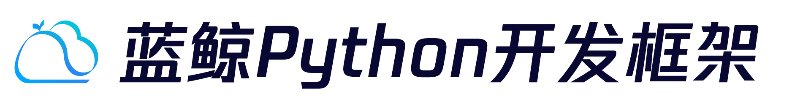
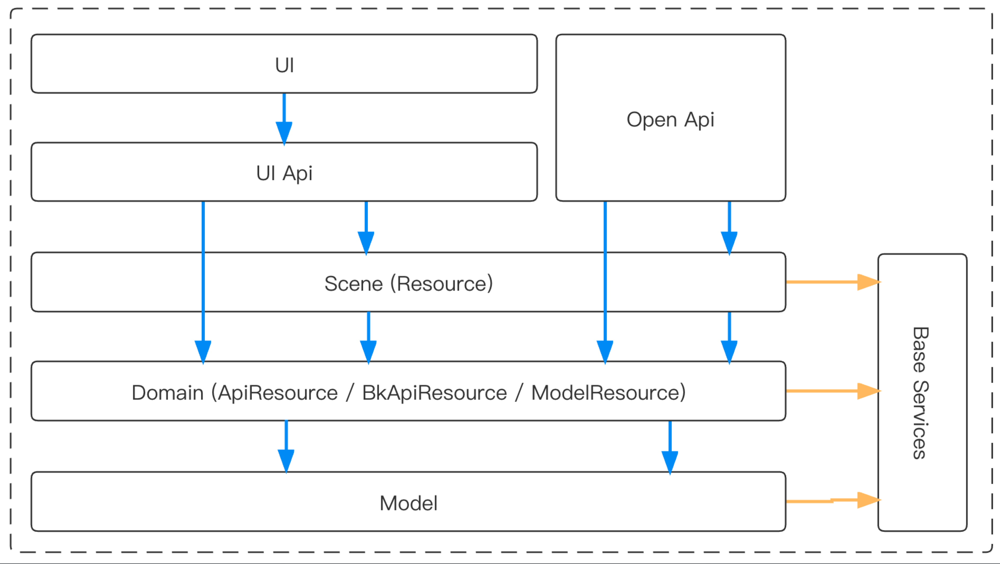

[](https://github.com/TencentBlueKing/bk-resource/blob/main/LICENSE.txt)
[](https://github.com/TencentBlueKing/bk-resource/releases)
[](https://github.com/TencentBlueKing/bk-resource/pulls)
[](https://codecov.io/gh/TencentBlueKing/bk-resource)
[](https://github.com/TencentBlueKing/bk-resource/actions/workflows/unittest.yml)

## Overview

`bk_resource`, is a scaffold based on [Blueapps](https://github.com/TencentBlueKing/blueapps) and [Django Rest Framework](https://github.com/encode/django-rest-framework), supports to quickly generate WEB SaaS projects that comply with the [`twelve-factor`](https://12factor.net/) specification and DDD (Domain-Driven Design) development mode.

## Features

- [Basic] Based on `Django`, generate standard `swagger API`
- [Basic] Based on `django-environ`, adapt both environment variables and `.env` file
- [Basic] Support for `PEP-621` with config plan of mypy, isort, flake8, black
- [Basic] Support for code standardization tools: `pre-commit`、`code-cc`
- [Resource] Integrate `bk_resource` to organize project directory structure, declare business logic through `Resource`, compatible with DDD development mode.
- [Resource] Support to use `ApiResource` / `BkApiResource` fo third-party `API`

## Getting started

### Installation

```bash
$ pip install cookiecutter
$ cookiecutter https://github.com/TencentBlueKing/bk-resource.git --checkout main --directory template
```

### Usage

- [Quick Start](template/readme.md)
- [Usage Doc](docs/usage.md)

### Domain Driven Design Development Practices



- Api Interaction Layer    
    Expose services to users through UI Api or Open Api, and the corresponding Api is responsible for connecting the corresponding business logic.
- Scene Layer   
    When accessing the backend through Api, the actual access is a scene service exposed by Resource, which connects the business logic of the domain layer.
- Domain Layer   
    The domain layer focuses on the corresponding sub-modules, responsible for handling the specific business logic, such as, in the user module, processing user registration, login, password modification, password reset, etc.
- Model Layer   
    In the MVC framework (such as Django), the code architecture is divided into Model, View, and Controller layers. The View is used for display. In the practice of front-end and back-end separation development and deployment, it is no longer processed by the backend, and the backend only needs to handle Model & Controller.

## Roadmap

- [Release Log](release.md)

## Support

- [BK Forum](https://bk.tencent.com/s-mart/community)
- [BK DevOps Online Video Tutorial (In Chinese)](https://bk.tencent.com/s-mart/video/)
- [Technical Exchange QQ Group](https://jq.qq.com/?_wv=1027&k=5zk8F7G)

## BlueKing Community

- [BK-CMDB](https://github.com/Tencent/bk-cmdb): BlueKing CMDB is an enterprise-level management platform designed for assets and applications.
- [BK-CI](https://github.com/Tencent/bk-ci): BlueKing Continuous Integration platform is a free, open source CI service, which allows developers to automatically create - test - release workflow, and continuously, efficiently deliver their high-quality products.
- [BK-BCS](https://github.com/Tencent/bk-bcs): BlueKing Container Service is a container-based basic service platform that provides management service to microservice businesses.
- [BK-PaaS](https://github.com/Tencent/bk-paas): BlueKing PaaS is an open development platform that allows developers to efficiently create, develop, set up, and manage SaaS apps.
- [BK-SOPS](https://github.com/Tencent/bk-sops): BlueKing SOPS is a system that features workflow arrangement and execution using a graphical interface. It's a lightweight task scheduling and arrangement SaaS product of the Blueking system.
- [BK-JOB](https://github.com/Tencent/bk-job):BlueKing JOB is a set of operation and maintenance script management platform with the ability to handle a large number of tasks concurrently.


## Contributing

If you have good ideas or suggestions, please let us know by Issues or Pull Requests and contribute to the Blue Whale Open Source Community.      
[Tencent Open Source Incentive Program](https://opensource.tencent.com/contribution) welcome developers from all over the globe to contribute to Tencent Open Source projects.

## License

Based on the MIT protocol. Please refer to [LICENSE](LICENSE.txt)
